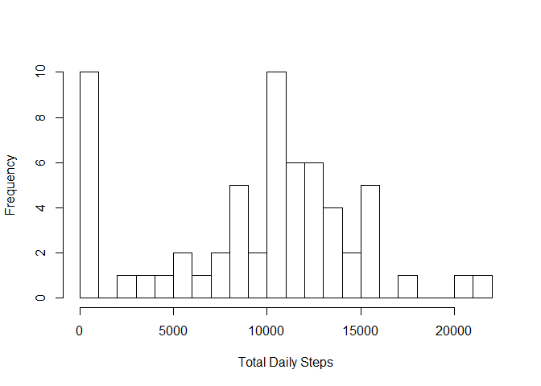
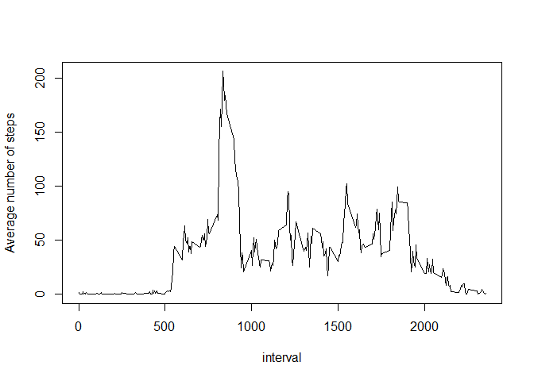
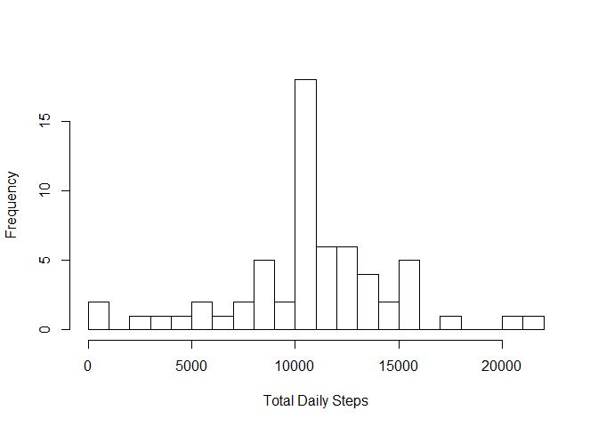
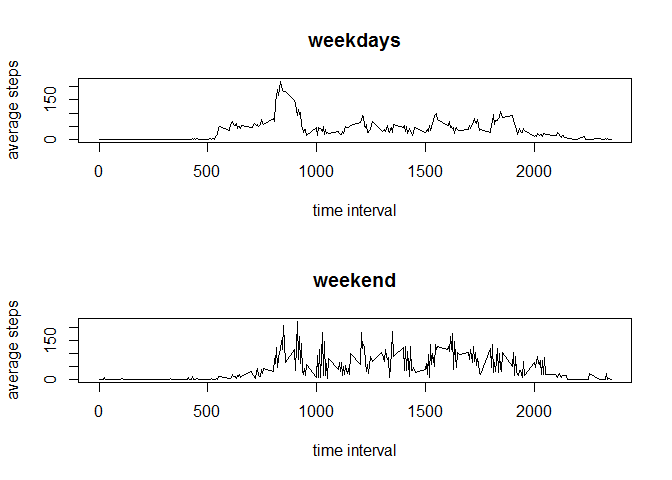

# Reproducible Research: Peer Assessment 1


## Loading and preprocessing the data

the package dplys is loaded for further data processing and the activity data is loaded:

```r
library("dplyr")
```

```
## Warning: package 'dplyr' was built under R version 3.2.1
```

```
## 
## Attaching package: 'dplyr'
## 
## The following objects are masked from 'package:stats':
## 
##     filter, lag
## 
## The following objects are masked from 'package:base':
## 
##     intersect, setdiff, setequal, union
```

```r
activity <- read.csv("activity.csv")
```


## What is mean total number of steps taken per day?

The total number of steps per day is calculated and presented in a histogram:


```r
act_by_date <- group_by(activity,date)
Total_steps_by_date <- summarise(act_by_date, sum(steps, na.rm = TRUE))
names(Total_steps_by_date)[2] <- 'Total_steps'
hist(Total_steps_by_date$Total_steps, breaks = 20, xlab = 'Total Daily Steps', main = '')
```

 

The mean and median of the daily steps are given by:


```r
mean(Total_steps_by_date$Total_steps)
```

```
## [1] 9354.23
```

```r
median(Total_steps_by_date$Total_steps)
```

```
## [1] 10395
```

## What is the average daily activity pattern?

we now make a plot of the average number of steps as a function of the time in a day:


```r
act_by_interval <- group_by(activity,interval)
Average_steps_by_interval <- summarise(act_by_interval, mean(steps, na.rm = TRUE))
names(Average_steps_by_interval)[2] <- 'Means'
plot(Average_steps_by_interval, type = 'l', ylab = 'Average number of steps')
```

 

The interval with the highest average number of steps is:


```r
arrange(Average_steps_by_interval,desc(Means))[1,]
```

```
## Source: local data frame [1 x 2]
## 
##   interval    Means
## 1      835 206.1698
```

## Imputing missing values

The total number of missing values is:


```r
sum(is.na(activity$steps))
```

```
## [1] 2304
```

We decide to replace the missing values by the average steps for that time interval. A new data frame called activity_no_nas is created with the na values replaced:


```r
activity_nas <- activity[is.na(activity$steps),]
activity_nas$steps <- subset(Average_steps_by_interval, interval %in% activity_nas$interval)$Means
activity_no_nas <- arrange(rbind(activity[!is.na(activity$steps),],activity_nas), date, interval)
```

We now look at the histogram for the total number of steps per day with the missing values replaced:


```r
act_by_date2 <- group_by(activity_no_nas,date)
Total_steps_by_date2 <- summarise(act_by_date2, sum(steps))
names(Total_steps_by_date2)[2] <- 'Total_steps'
hist(Total_steps_by_date2$Total_steps, breaks = 20, xlab = 'Total Daily Steps', main = '')
```

 

The mean and median of the daily steps with the missing values replaced are now equal:


```r
mean(Total_steps_by_date2$Total_steps)
```

```
## [1] 10766.19
```

```r
median(Total_steps_by_date2$Total_steps)
```

```
## [1] 10766.19
```
## Are there differences in activity patterns between weekdays and weekends?

We add a column indicating whether it is a weekday or in a weekend. The number of steps are then averaged over the days and split in two data frames for weekdays and weekends:


```r
activity_no_nas$day <- ifelse(weekdays(as.Date(activity_no_nas$date)) == c('zaterdag','zondag'),'weekend','weekday')
activity_by_day_and_interval <- group_by(activity_no_nas,day,interval)
act_averaged <- summarise(activity_by_day_and_interval, mean(steps))
names(act_averaged)[3] = 'Average'
act_weekdays <- filter(act_averaged, day == 'weekday')
act_weekend <- filter(act_averaged, day == 'weekend')
```

Finally, we plot the aberage numer of steps as a function of the time interval for weekdays and weekends separately:


```r
par(mfrow=c(2,1))
plot(act_weekdays$interval,act_weekdays$Aver, type = 'l', xlab = 'time interval', ylab = 'average steps', main = 'weekdays')
plot(act_weekend$interval,act_weekend$Aver, type = 'l', xlab = 'time interval', ylab = 'average steps', main = 'weekend')
```

 
